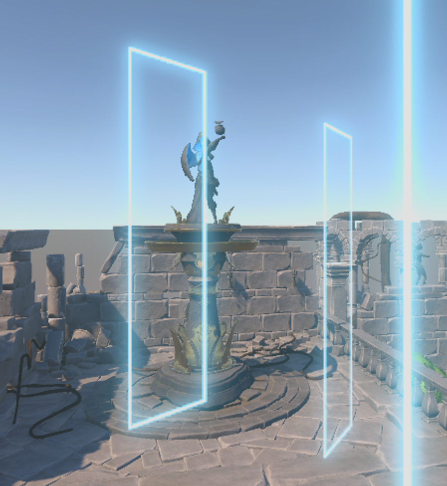
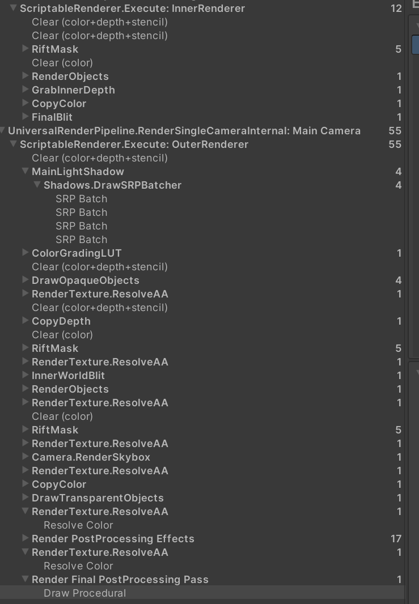
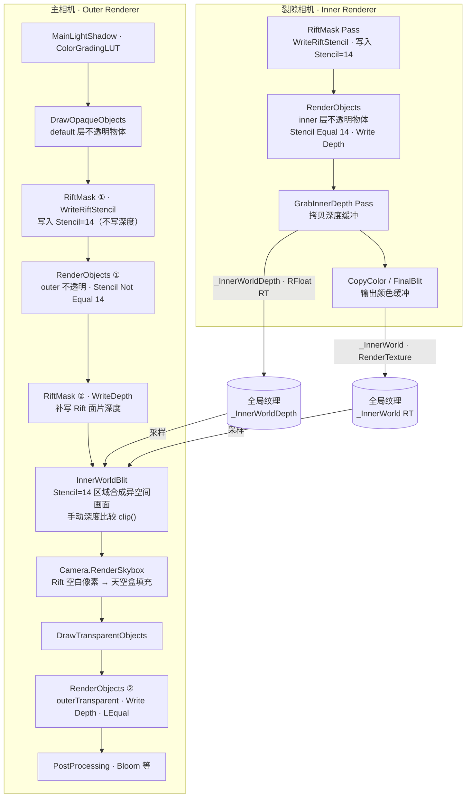
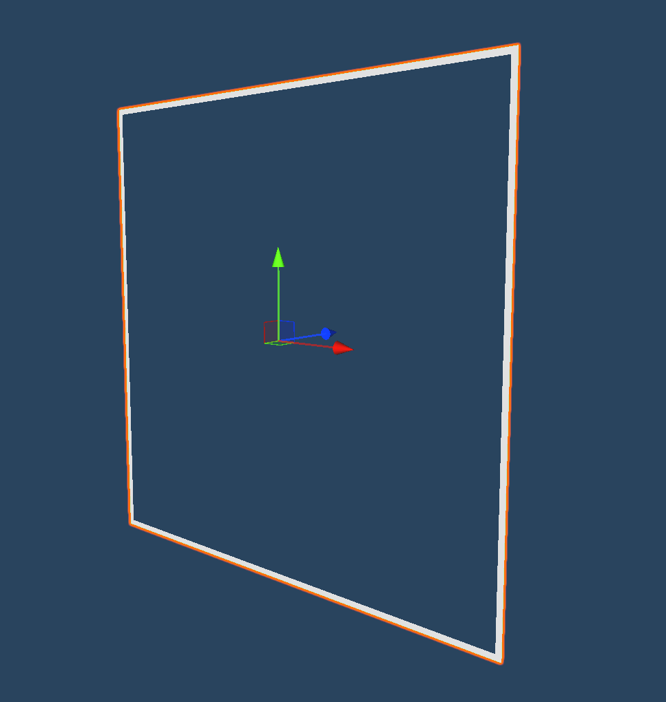
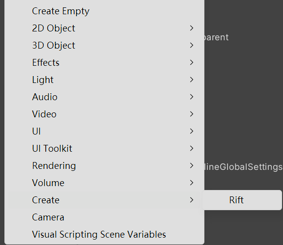
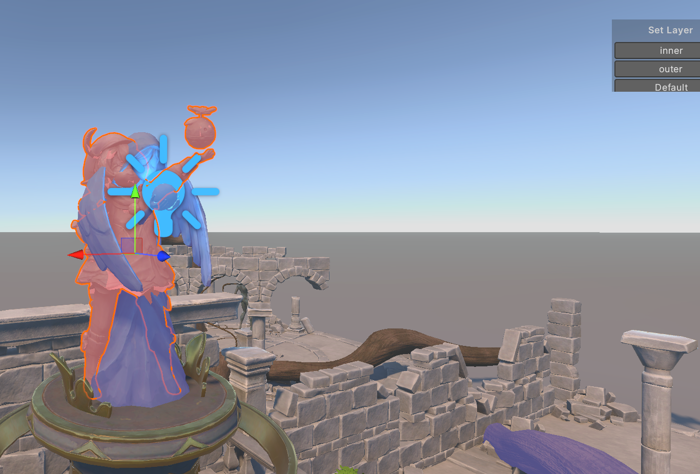
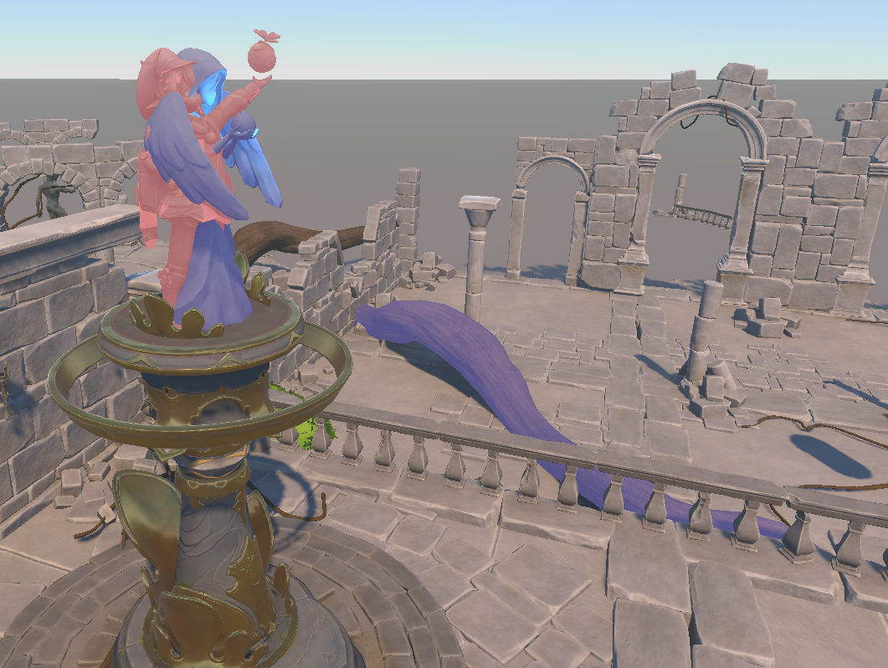
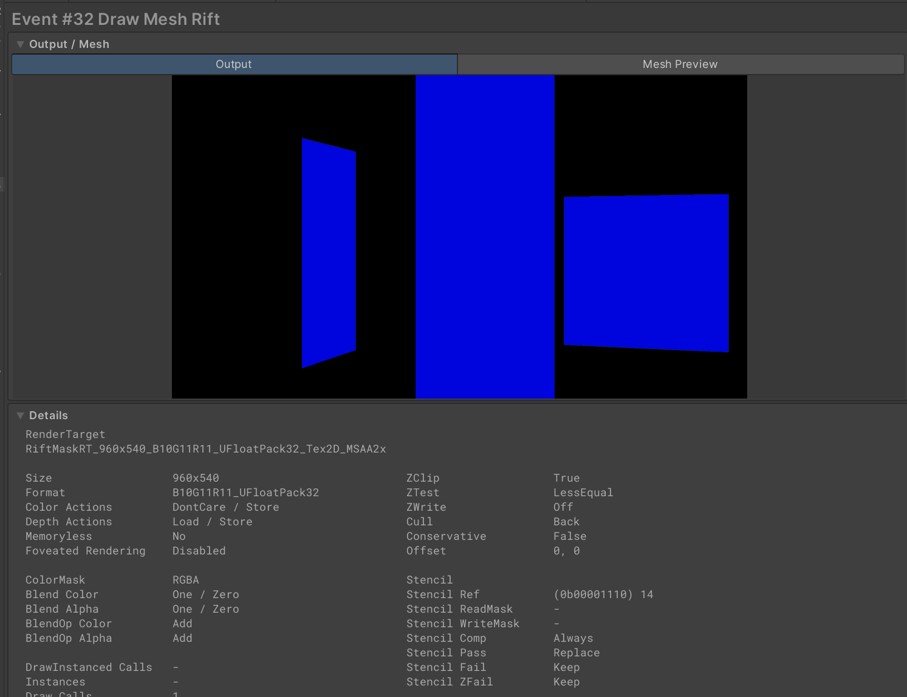
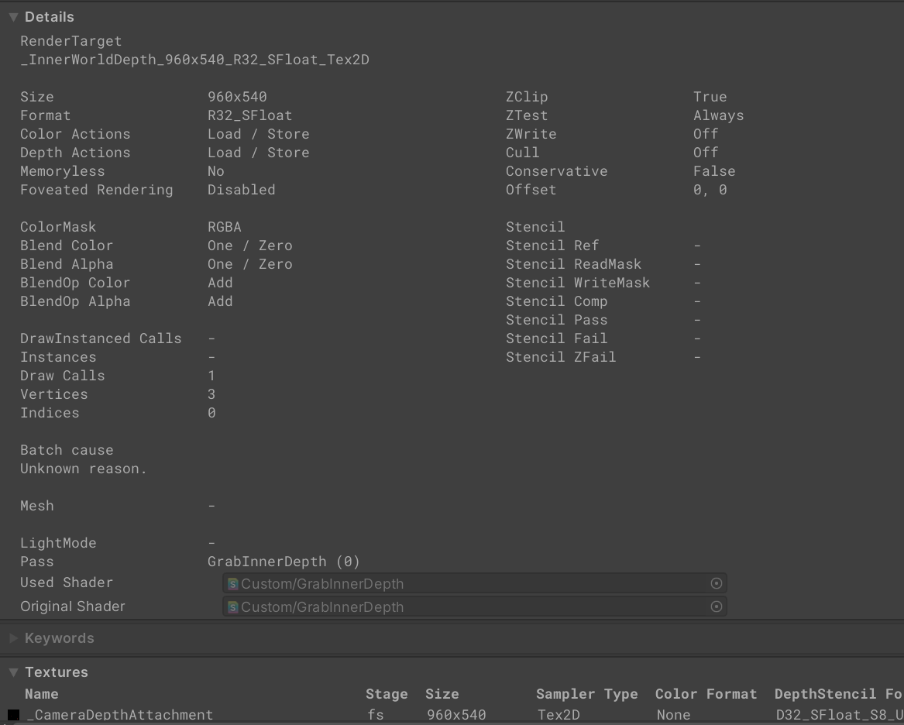
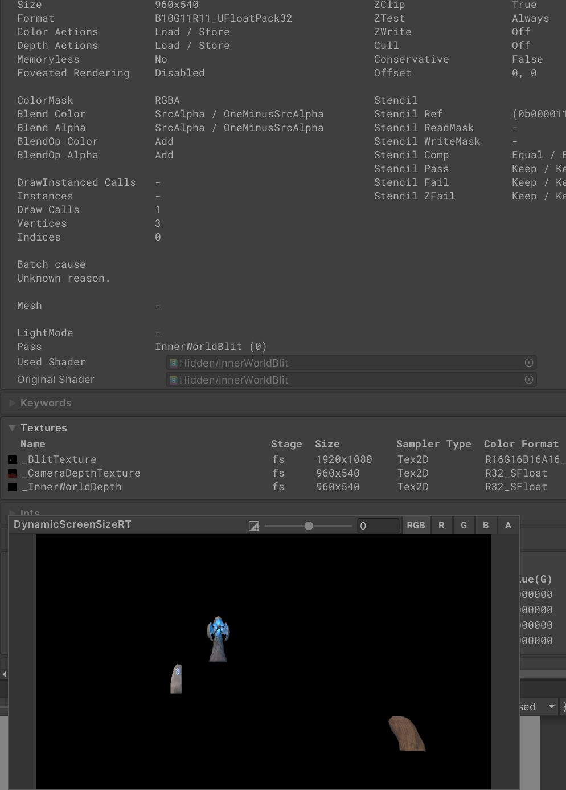

# Rift 系统技术文档

> Unity版本: 2022.3.62f3 URP 14.0.12
> 移动端测试平台：OnePlus8 高通骁龙865
> 总工时：约 8 h
> 外部资产：Mesh + texture 来自https://assetstore.unity.com/packages/3d/environments/fantasy/idyllic-ancient-ruins-v2-288471?srsltid=AfmBOooUcHLvvqeBH5aYSxaCKGA0XgijLU8QC4Ps5cTpWaLMPpZexXbO
> 脚本，shader，renderer feature 全部自制

---

## 设计思路

Rift 系统的核心挑战在于：让同一世界坐标处的两个外观不同的物体，分别只在特定观察条件下可见，且两者需要参与正确的深度遮挡关系。

**双相机 + 双 Renderer 架构**是解决这一问题的关键决策：

- **裂隙相机（Inner Renderer）** 专职渲染异空间内容，输出颜色与深度两张全局纹理。其 Renderer 是一个极度精简的自定义管线——跳过了 URP 的阴影（也可以选择开启，inner/outer共用shadermap）、LUT、天空盒、后处理等所有内置 Pass，每帧仅执行 3 个自定义 Pass（Stencil 标记 → 渲染内世界物体 → 拷贝深度），将额外的渲染开销压缩到最低。

- **主相机（Outer Renderer）** 负责渲染现实空间，并通过 Stencil 在 Rift 面片投影区域将内世界画面合成进来。合成时不直接使用硬件深度测试，而是在片元着色器内对两台相机各自的深度分别线性化后手动比较，从而在两台相机近/远裁剪面不同的情况下仍能保证正确遮挡。

- **天空盒的可见性**利用了 WriteDepth 与 InnerWorldBlit 的配合：Rift 面片内没有内世界物体的区域，InnerWorldBlit 通过 `clip()` 不写入任何内容，深度缓冲保持为空，主相机天空盒随后可以在该区域正常渲染，无需任何额外处理。

- **屏幕空间复用**：两台相机共享世界坐标系，屏幕 UV 完全对齐，内世界颜色与深度可以直接按屏幕坐标采样，无需重投影矩阵，设计简洁且无精度损失。

整套架构设计上可复用：通过调整物体 Layer、放置 Rift Prefab，即可在场景任意位置添加新的跨时空造物，无需修改任何渲染代码。


---

## 目录

1. [系统概述](#1-系统概述)
2. [核心概念](#2-核心概念)
3. [渲染流程总览](#3-渲染流程总览)
4. [层级（Layer）约定](#4-层级layer约定)
5. [工作流与编辑器工具](#5-工作流与编辑器工具)
  - 5.1 [Rift Prefab 使用指南](#51-rift-prefab-使用指南)
  - 5.2 [新增"跨时空造物"资产流程](#52-新增跨时空造物资产流程)
  - 5.3 [编辑器工具](#53-编辑器工具)
6. [Renderer 配置详解](#6-renderer-配置详解)
  - 6.1 [Inner Renderer（裂隙相机）](#61-inner-renderer裂隙相机)
  - 6.2 [Outer Renderer（主相机）](#62-outer-renderer主相机)
7. [Renderer Feature 说明](#7-renderer-feature-说明)
  - 7.1 [RiftMaskRendererFeature](#71-riftmaskrendererfeature)
  - 7.2 [GrabInnerDepthFeature](#72-grabinnerdepthfeature)
  - 7.3 [InnerWorldBlitFeature](#73-innerworldblitfeature)
8. [关键 Shader 说明](#8-关键-shader-说明)

---

## 1. 系统概述

**Rift 系统**实现了一种"跨时空裂缝（Rift）"渲染效果：场景中存在一块特殊的面片（Rift 面片），透过它可以看到与现实世界在同一位置、但外观不同的"异空间"版本的物体。

以测试用资产为例：
- 在正常主摄像机视角下，玩家看到的是 **Statue_Anemo**（现实空间版本）。
- 透过 Rift 面片观察同一位置时，看到的是 **Statue_Klee**（异空间版本）。

该效果通过两台摄像机 + 双 Renderer 的方式实现，设计上支持在场景中任意坐标、任意环境中复用。

---

## 2. 核心概念

| 概念 | 说明 |
|------|------|
| **Rift 面片** | 场景中代表裂隙入口的网格面片，承担模板（Stencil）标记与异空间图像合成的视觉入口 |
| **裂隙相机（Rift Camera）** | 附带 Inner Renderer 的独立相机，渲染异空间内容并输出到 RenderTexture |
| **主相机（Main Camera）** | 使用 Outer Renderer 渲染现实空间，并在 Rift 面片区域合成异空间画面 |
| **跨时空造物** | 同时存在于两个空间、外观不同的资产对；分别挂在 `inner` 层和 `outer` 层 |
| **Stencil 值 14** | 全局约定的 Rift 区域标记值，用于所有相关 Pass 的模板测试 |

---

## 3. 渲染流程总览


```
每帧渲染顺序
│
├─ [1] 裂隙相机（Inner Renderer）
│      ├─ RiftMask Pass        → 将 Rift 层物体写入 Stencil=14（WriteRiftStencil 着色器）
│      ├─ RenderObjects Pass   → 仅渲染 inner 层的不透明物体
│      │    (Stencil Equal 14，Write Depth)
│      ├─ GrabInnerDepth Pass  → 将裂隙相机深度拷贝为全局 RT _InnerWorldDepth ──┐
│      ├─ CopyColor / FinalBlit → 输出到 _InnerWorld RT（RenderCameraToRT 管理）──┤
│      └─ （两张全局纹理写入完毕，等待主相机采样）                                   │
│                                                                               │(跨 Renderer 全局纹理)
└─ [2] 主相机（Outer Renderer）                                                   │
       ├─ ...                                                                   │
       └─ InnerWorldBlit Pass  ← 读取 _InnerWorld + _InnerWorldDepth ───────────┘
│
└─ [2] 主相机（Outer Renderer）  ← 消费裂隙相机产出的 _InnerWorld 与 _InnerWorldDepth 两张全局纹理
       ├─ MainLightShadow / ColorGradingLUT
       ├─ DrawOpaqueObjects    → 渲染所有默认不透明物体
       ├─ RiftMask Pass ×2
       │    ① WriteRiftStencil → Stencil=14 标记 Rift 面片区域
       │    ② WriteDepth       → 为 Rift 区域写入深度（防止异空间被遮挡）
       ├─ InnerWorldBlit Pass  → 在 Stencil=14 区域，将 _InnerWorld RT 合成到主色彩缓冲
       │    （深度比较：仅在内世界物体更近时绘制，实现正确遮挡）
       ├─ Camera.RenderSkybox  → Rift 面片内无内世界物体的空白区域可正常进行天空渲染
       ├─ DrawTransparentObjects
       ├─ RenderObjects Pass   → 渲染 outer 层透明物体（Write Depth, LEqual）
       └─ PostProcessing（Bloom 等）
```



> 技术要点：两台相机使用**相同的世界空间坐标系**，因此屏幕 UV 可以直接对应，无需额外重投影。  
> **跨 Renderer 数据流**：裂隙相机通过 `_InnerWorld`（颜色）和 `_InnerWorldDepth`（深度）两张全局纹理将结果传递给主相机；前者由 `RenderCameraToRT` 管理，后者由 `GrabInnerDepthFeature` 在内世界不透明物体渲染完毕后立即写入。

### 性能设计要点

**Inner Renderer 精简 Pass 开销**

裂隙相机使用独立的 `InnerRenderer.asset`，而非默认的 Universal Renderer。这意味着 URP 内置的大量 Pass 对裂隙相机完全不执行，包括：

| 跳过的 Pass | 说明 |
|-------------|------|
| MainLightShadow / AdditionalLightShadow（可选择开启，inner/outer共用 ShadowMap） | 异空间物体无需参与阴影贴图烘焙 |
| ColorGradingLUT | 无需对异空间画面做独立色彩分级 |
| DepthNormals PrePass | 裂隙相机不使用屏幕空间 AO / 法线效果 |
| Camera.RenderSkybox | 异空间天空无需单独渲染，空白区域由主相机天空盒填充 |
| DrawObjects（URP 内置） | 异空间物体可按需渲染 |
| PostProcessing（Bloom、Tonemapping 等） | 后处理在主相机统一执行一次 |

最终裂隙相机每帧只执行 **3 个自定义 Pass**（RiftMask → RenderObjects → GrabInnerDepth），相比完整 URP 管线节省了约 10+ 个内置 Pass 的 CPU/GPU 提交开销。

**其他性能友好设计**

- **Stencil 门控 Blit**：`InnerWorldBlit` 是全屏 Pass，但片元着色器仅在 Stencil=14 的像素处执行，GPU 实际填充量等价于 Rift 面片在屏幕上的投影面积，而非全屏。  
- **无重投影**：两台相机共用世界坐标系，屏幕 UV 直接对应，Blit 无需矩阵变换。  
- **按层剔除**：裂隙相机的 Culling Mask 仅含 `inner` 层，Draw Call 数量严格控制在异空间造物范围内。

---

## 4. 层级（Layer）约定

项目使用 Unity Layer 区分三类场景物体：

| Layer 名称 | 含义 | 在哪台相机可见 |
|------------|------|---------------|
| `inner` | **异空间**版本的造物 | 仅裂隙相机（Inner Renderer） |
| `outer` | **现实空间**版本的造物（含 Rift 面片本身） | 仅主相机（Outer Renderer） |
| `default`（其余层） | 两个空间共享的物体（地面、背景等） | 两台相机均可见 |

> **注意**：Rift 面片自身属于 `outer` 层，用于向主相机写入 Stencil 标记。`Rift` 层专门用于 RiftMask Pass 的 Layer Mask 过滤，仅包含 Rift 面片网格。

---

## 5. 工作流与编辑器工具

### 5.1 Rift Prefab 使用指南

**文件**：`Assets/Prefabs/Rift.prefab`

此 Prefab 是 Rift 面片的完整预制件，包含面片网格、RiftFrame 材质及 RiftThickness 脚本等必要组件。



> 多个 Rift 面片可在场景中共存，每个 Prefab 实例独立控制边框粗细；Stencil 值全局统一为 14，无需单独配置。

---

### 5.2 新增"跨时空造物"资产流程

按以下步骤将一对美术资产配置为"跨时空造物"：

#### 步骤一：准备两份网格/材质

- **现实版本**（如 `Statue_Anemo`）：使用正常材质，赋给 `outer` 层。
- **异空间版本**（如 `Statue_Klee`）：使用异空间材质，赋给 `inner` 层。

#### 步骤二：在场景中摆放

1. 将两个 GameObject 放置在**完全相同的世界坐标**。
2. 设置层级：
  - 现实版本 → Layer: **outer**
  - 异空间版本 → Layer: **inner**

#### 步骤三：确认摄像机可见性

| 相机 | 应可见的层 |
|------|-----------|
| Main Camera | `default`, `outer`（不含 `inner`） |
| Rift Camera | `default`, `inner`（不含 `outer`） |

> 在各相机的 `Culling Mask` 中确认上述设置，防止穿帮。

---

### 5.3 编辑器工具

项目提供三项编辑器扩展，辅助美术与策划人员高效完成资产布设，无需手动操作层级或查找 Prefab。


#### 5.3.1 RiftSpawner — 一键生成 Rift 面片

**脚本**：`Assets/Editor/RiftSpawner.cs`  
**入口**：Hierarchy 右键菜单 → **GameObject / Create / Rift**

在 Hierarchy 或 Scene 视图中右键，选择 **Create → Rift**，即可在当前选中物体的子节点下（或场景根节点）实例化 `Rift.prefab`，并自动完成以下操作：

- 在项目中按名称精确查找 `rift`（大小写不敏感）Prefab
- 实例化并对齐到父节点位置（无父节点则置于世界原点）
- 注册 Undo 操作，支持 Ctrl+Z 撤销
- 自动选中新建实例，便于立即调整参数

> 若项目中找不到名为 `rift` 的 Prefab，会弹出提示对话框，不会静默失败。

---

#### 5.3.2 LayerSetterTool — 快速设置物体层级

**脚本**：`Assets/Editor/LayerSetterTool.cs`  
**设置入口**：菜单栏 **Tools → Layer Setter → Settings**  
**使用入口**：Hierarchy 右键菜单 → **Set Layer...** / Scene 视图右上角悬浮面板


该工具提供三种方式快速为选中物体设置 Layer，无需打开 Inspector 手动操作。

##### 配置允许的层（Settings 窗口）

打开 **Tools → Layer Setter → Settings**，在窗口中添加或删除允许出现在快捷菜单中的层。配置持久保存在 `EditorPrefs` 中，重启 Unity 后不丢失。

推荐预先添加以下层供 Rift 工作流使用：

| Layer | 用途 |
|-------|------|
| `inner` | 异空间版本造物 |
| `outer` | 现实空间版本造物 |
| `Rift` | Rift 面片网格本身 |

##### 右键菜单

在 Hierarchy 中选中一个或多个 GameObject，右键选择 **Set Layer...**，从下拉列表中选择目标层。若所选物体含有子节点，会询问是否同步应用到所有子节点。操作可 Undo。

##### Scene 视图悬浮面板

Scene 视图右上角（选中任意 GameObject 时自动出现）显示快捷按钮面板，点击层名即可直接设置，无需打开右键菜单，适合在布置场景时频繁切换层。

---

#### 5.3.3 ViewRenderer — Scene 视图层级可视化

**文件**：`Assets/Renderer/ViewRenderer.asset`  
**作用相机**：Scene 视图（仅编辑器内可见，不影响运行时）

Scene 视图使用独立的 `ViewRenderer`，在正常渲染之上叠加两个 RenderObjects Override Material Pass，为不同层的物体叠加半透明色标，便于在编辑器中直观区分两个空间的物体归属：

| Layer | 覆盖材质 | 色标含义 |
|-------|----------|----------|
| `inner`（异空间） | `inner.mat`（`PureColorTransparent`） | 半透明色块标识异空间造物 |
| `outer`（现实空间） | `outer.mat`（`PureColorTransparent`） | 半透明色块标识现实空间造物 |

两个 Pass 均在 `AfterRenderingTransparents` 时机以 Override Material 模式执行，不干扰物体的实际材质，仅在 Scene 视图中叠加显示。

> 如需调整色标颜色，直接修改 `inner.mat` / `outer.mat` 的颜色属性即可，无需改动任何代码。

---

## 6. Renderer 配置详解

### 6.1 Inner Renderer（裂隙相机）

**文件**：`Assets/Renderer/InnerRenderer.asset`

**挂载相机**：场景中的 **Rift Camera**（附带 `RenderCameraToRT` 脚本）

#### Feature 执行顺序

| # | Feature | Pass Tag | 时机 | 作用 |
|---|---------|----------|------|------|
| 1 | **RiftMaskRendererFeature** | `RiftMask` | After Rendering Pre Passes | 使用 `WriteRiftStencil` 着色器，将 `Rift` 层写入 Stencil=14，**不写深度** |
| 2 | **RenderObjects** | — | AfterRenderingOpaques | Layer=`inner`，Opaque；Override Depth(Write+LEqual)，Override Stencil(Equal 14, Fail→Zero)；仅在 Rift 区内绘制内世界物体 |
| 3 | **GrabInnerDepthFeature** | — | After Rendering Opaques | 将裂隙相机当前深度缓冲拷贝为全局纹理 `_InnerWorldDepth`（RFloat RT）；**此纹理由 Outer Renderer 的 InnerWorldBlit 消费**，用于逐像素深度比较 |

#### 关键参数

```
RiftMaskRendererFeature (Inner)
  Pass Tag              : RiftMask
  Render Pass Event     : After Rendering Pre Passes
  Override Shader       : Rift/Feature/WriteRiftStencil
  Override Shader Pass  : 0
  Mask Layer            : Rift
  Enable Depth Write    : 关闭
  Depth Compare         : Less Equal

RenderObjects (inner 层不透明)
  Event                 : AfterRenderingOpaques
  Queue                 : Opaque
  Layer Mask            : inner
  Override Depth        : Write Depth ON, Depth Test LEqual
  Override Stencil      : Value=14, Compare=Equal, Pass=Keep, Fail=Zero

GrabInnerDepthFeature
  Depth Copy Shader     : Custom/GrabInnerDepth
  Render Pass Event     : After Rendering Opaques
```

---

### 6.2 Outer Renderer（主相机）

**文件**：`Assets/Renderer/OuterRenderer.asset`

**挂载相机**：场景中的 **Main Camera**

#### Feature 执行顺序

| # | Feature | Pass Tag | 时机 | 作用 |
|---|---------|----------|------|------|
| 1 | **RiftMaskRendererFeature** ① | `RiftMask` | After Rendering Opaques | 使用 `WriteRiftStencil`，将 `Rift` 层写入 Stencil=14（不写深度） |
| 2 | **RenderObjects** ① | — | AfterRenderingOpaques | Layer=`outer`，Opaque；Stencil Not Equal 14，隐藏被 Rift 面片遮住的区域 |
| 3 | **RiftMaskRendererFeature** ② | `RiftMask` | After Rendering Opaques | 使用 `Shader Graphs/WriteDepth`，为 Rift 面片区域补写深度 |
| 4 | **InnerWorldBlitFeature** | — | After Rendering Opaques | 在 Stencil=14 区域将 `_InnerWorld` RT 合成到主画面，并进行深度比较 |
| 5 | **RenderObjects** ② | — | AfterRenderingTransparents | Layer=`outerTransparent`，Transparent；Override Depth(Write+LEqual)；渲染现实空间透明物体 |

#### 关键参数

```
RiftMaskRendererFeature ① (写 Stencil)
  Pass Tag              : RiftMask
  Render Pass Event     : After Rendering Opaques
  Override Shader       : Rift/Feature/WriteRiftStencil
  Override Shader Pass  : 0
  Mask Layer            : Rift
  Enable Depth Write    : 关闭
  Depth Compare         : Less Equal

RenderObjects ① (outer 不透明，排除 Rift 区)
  Event                 : AfterRenderingOpaques
  Queue                 : Opaque
  Layer Mask            : outer
  Override Stencil      : Value=14, Compare=Not Equal, Pass=Keep, Fail=Keep

RiftMaskRendererFeature ② (写深度)
  Pass Tag              : RiftMask
  Render Pass Event     : After Rendering Opaques
  Override Shader       : Shader Graphs/WriteDepth
  Override Shader Pass  : 0
  Mask Layer            : Rift
  Enable Depth Write    : 开启
  Depth Compare         : Less Equal

InnerWorldBlitFeature
  Blit Material         : Hidden_InnerWorldBlit
  Render Pass Event     : After Rendering Opaques

RenderObjects ② (outerTransparent)
  Event                 : AfterRenderingTransparents
  Queue                 : Transparent
  Layer Mask            : outerTransparent
  Override Depth        : Write Depth ON, Depth Test LEqual
```

---

## 7. Renderer Feature 说明

### 7.1 RiftMaskRendererFeature

**脚本**：`Assets/RendererFeature/RiftMaskRendererFeature.cs`  
**Pass 脚本**：`Assets/RendererFeature/RiftMaskPass.cs`

功能：使用指定 Override Shader 重绘 Mask Layer 内的所有物体，输出结果到 `_RiftMaskRT`（全局纹理），同时可控制 Stencil 和深度写入。


可配置属性：

| 属性 | 类型 | 说明 |
|------|------|------|
| `Pass Tag` | string | ProfilingSampler 标签，用于 Frame Debugger 标识 |
| `Render Pass Event` | RenderPassEvent | 注入时机 |
| `Override Shader` | Shader | 替换所有物体渲染时使用的着色器 |
| `Override Shader Pass Index` | int | 着色器 Pass 序号 |
| `Mask Layer` | LayerMask | 参与此 Pass 的物体层 |
| `Enable Depth Write` | bool | 是否写深度 |
| `Depth Compare Function` | CompareFunction | 深度比较函数 |

> Preview 与 Reflection 相机会自动跳过该 Feature，避免渲染错误。

---

### 7.2 GrabInnerDepthFeature


**脚本**：`Assets/RendererFeature/GrabInnerDepthFeature.cs`  
**Pass 脚本**：`Assets/RendererFeature/GrabInnerDepthPass.cs`

功能：在裂隙相机渲染完不透明物体后，将当前深度缓冲拷贝到一张 `RFloat` 格式的 RT `_InnerWorldDepth`，供后续 InnerWorldBlit 做深度比较。

| 属性 | 说明 |
|------|------|
| `Depth Copy Shader` | 必须指定为 `Custom/GrabInnerDepth` |
| `Render Pass Event` | 建议 After Rendering Opaques（内世界物体渲染完毕后） |

---

### 7.3 InnerWorldBlitFeature


**脚本**：`Assets/RendererFeature/InnerWorldBlitFeature.cs`  
**Pass 脚本**：`Assets/RendererFeature/InnerWorldBlitPass.cs`

功能：将裂隙相机输出的 `_InnerWorld` RenderTexture 合成到主相机画面。合成时：
- 仅在 **Stencil=14** 的像素处绘制（由 `Hidden/InnerWorldBlit` 着色器的 Stencil 测试控制）。
- 使用 `_InnerWorldDepth` 与主相机深度做逐像素比较，确保内世界物体能被现实空间物体正确遮挡。

| 属性 | 说明 |
|------|------|
| `Blit Material` | 必须指定为 `Hidden_InnerWorldBlit` 材质 |
| `Render Pass Event` | After Rendering Opaques（在 Rift 深度写入之后） |

> `_InnerWorld` RenderTexture 由 **RenderCameraToRT** 脚本在运行时创建并通过 `RenderCameraToRT.RT` 静态属性共享。Feature 在 `Create()` 时读取该静态属性。

---

## 8. 关键 Shader 说明

### Rift/Feature/WriteRiftStencil
**文件**：`Assets/Shader/RiftFeature/WriteRiftStencil.shader`

将物体渲染到屏幕，同时向模板缓冲写入固定值 **14**，颜色输出为蓝色占位（视觉上不可见，被后续 Pass 覆盖）。不写深度，深度测试 LEqual。

---

### Shader Graphs/WriteDepth
**文件**：`Assets/Shader/RiftFeature/WriteDepth.shadergraph`

仅写入深度缓冲，不输出颜色。在 InnerWorldBlit 完成合成后执行，将 Rift 面片网格的实际深度写入深度缓冲：已渲染内世界内容的区域将被正确递挡，而 Rift 面片内无内世界物体的空白区域由于 InnerWorldBlit 已通过 `clip()` 丢弃该部分，深度缓冲为空，天空盒可正常在该区域渲染。

---

### Custom/GrabInnerDepth
**文件**：`Assets/Shader/RiftFeature/grabinnerdepth.shader`

全屏 Blit Pass：将 `_CameraDepthAttachment` 的原始深度值（raw）输出到 R 通道的 RFloat 纹理 `_InnerWorldDepth`，供 `Hidden/InnerWorldBlit` 读取。

---

### Hidden/InnerWorldBlit
**文件**：`Assets/Shader/RiftFeature/InnerWorldBlit.shader`

主合成 Shader，核心逻辑如下：

**Stencil 门控**：`Ref=14, Comp=Equal`，确保只在 Rift 面片投影的像素处执行片元着色器。

**手动深度比较（替代硬件深度测试）**：  
Pass 设置 `ZTest Always`，在片元着色器内对两台相机的深度分别线性化后手动比较：

```hlsl
// 内世界深度：使用内世界相机自身的 ZBufferParams 线性化
float innerRaw    = SAMPLE_TEXTURE2D(_InnerWorldDepth, sampler_InnerWorldDepth, screenUV).r;
float innerLinear = 1.0 / (_InnerWorldZBufferParams.z * innerRaw + _InnerWorldZBufferParams.w);

// 主相机深度：使用全局 _ZBufferParams 线性化
float cameraRaw    = SampleSceneDepth(screenUV);
float cameraLinear = LinearEyeDepth(cameraRaw, _ZBufferParams);

// 仅当内世界物体更近或相等时才绘制，否则丢弃
clip(cameraLinear - innerLinear);
```

两台相机的近/远裁剪面可以不同，因此必须用各自的 ZBufferParams 分别线性化再比较，不能混用硬件深度缓冲直接比较原始值。`_InnerWorldZBufferParams` 由 `RenderCameraToRT.Update()` 每帧写入全局。

**颜色输出**：采样 `_BlitTexture`（即 `_InnerWorld` RT），以 `Blend SrcAlpha OneMinusSrcAlpha` 混合输出，支持异空间物体的半透明边缘。

---

### Shader Graphs/RiftFrame
**文件**：`Assets/Shader/RiftFeature/RiftFrame.shadergraph`

Rift 面片边框效果着色器，读取全局 `_framethick` 参数控制边框宽度（由 `RiftThickness` 脚本每帧更新）。

---
